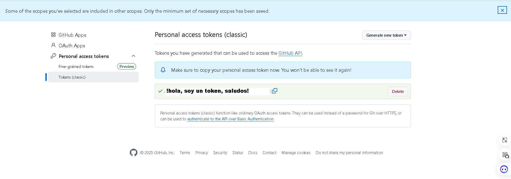
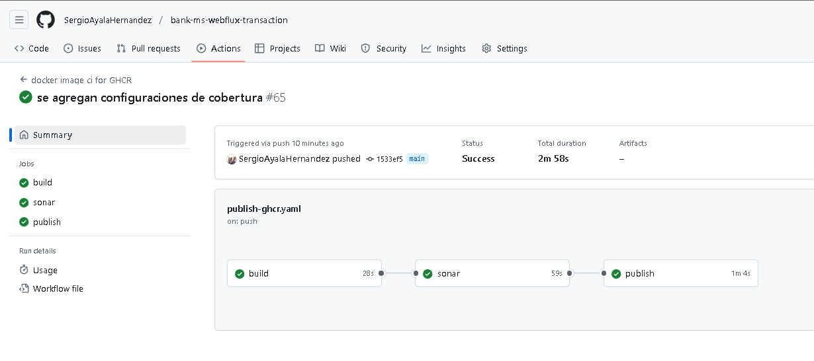
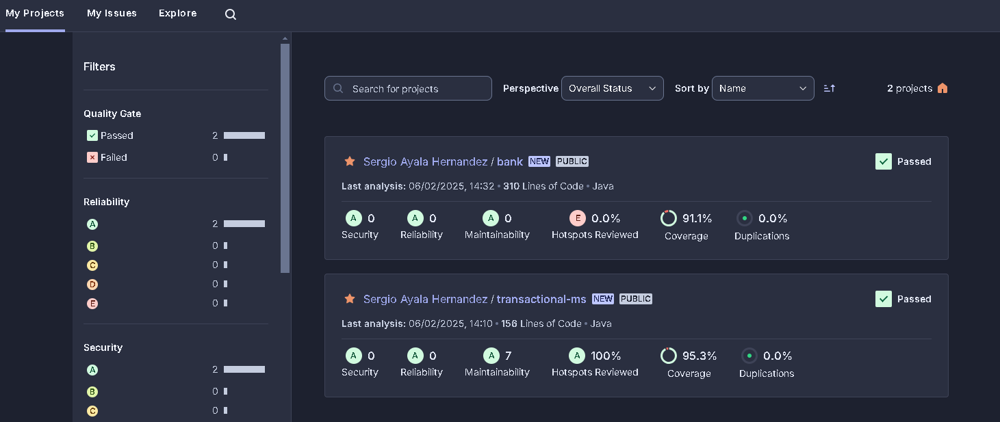

# README: transactional-ms

## Descripción del Proyecto
Este es un microservicio basado en Spring WebFlux llamado `transactional-ms`. Su propósito principal es gestionar transacciones de manera reactiva, interactuando con otros microservicios para validar cuentas y actualizar saldos.

### Tecnologías Utilizadas
- **Spring WebFlux**: Para desarrollar servicios reactivos no bloqueantes.
- **MongoDB Reactivo**: Base de datos no relacional para almacenamiento de transacciones.
- **SpringDoc**: Generación automática de documentación OpenAPI/Swagger.
- **Lombok**: Para reducir el código repetitivo.

---

## Configuración Inicial

### Propiedades del Microservicio

```properties
spring.application.name=transactional-ms

server.port=${PORT}

springdoc.swagger-ui.enabled=true
springdoc.api-docs.enabled=true
springdoc.swagger-ui.path=/swagger-ui.html
springdoc.api-docs.path=/v3/api-docs
springdoc.webjars.prefix=/webjars

server.servlet.context-path=/transactional-ms

spring.data.mongodb.uri=${MONGO_URI}
spring.data.mongodb.database=${MONGO_DATA_BASE}
```

### Dependencias Principales

```gradle
dependencies {
    implementation 'org.springframework.boot:spring-boot-starter-data-mongodb-reactive'
    implementation 'org.springframework.boot:spring-boot-starter-validation'
    implementation 'org.springframework.boot:spring-boot-starter-webflux'
    compileOnly 'org.projectlombok:lombok'
    annotationProcessor 'org.projectlombok:lombok'
    implementation 'org.springdoc:springdoc-openapi-starter-webflux-ui:2.3.0'
}
```

---

# Estructura del Proyecto: transactional-ms

A continuación, se detalla la estructura del proyecto **transactional-ms**. Este proyecto sigue una organización típica de una aplicación Java basada en Gradle, utilizando una arquitectura modular para mantener el código limpio y escalable.

## Estructura de Carpetas

```plaintext
C:.
├───.gradle
│   ├───8.11.1
│   │   ├───checksums
│   │   ├───executionHistory
│   │   ├───expanded
│   │   ├───fileChanges
│   │   ├───fileHashes
│   │   └───vcsMetadata
│   ├───buildOutputCleanup
│   └───vcs-1
├───.idea
│   ├───inspectionProfiles
│   └───modules
├───build
│   ├───classes
│   │   └───java
│   │       ├───main
│   │       │   └───com
│   │       │       └───example
│   │       │           └───transactionalms
│   │       │               ├───config
│   │       │               ├───controller
│   │       │               ├───dto
│   │       │               ├───model
│   │       │               ├───repository
│   │       │               └───service
│   │       └───test
│   │           └───com
│   │               └───example
│   │                   └───transactionalms
│   │                       └───controller
│   ├───generated
│   ├───reports
│   ├───resources
│   ├───test-results
│   └───tmp
├───gradle
│   └───wrapper
└───src
    ├───main
    │   ├───java
    │   │   └───com
    │   │       └───example
    │   │           └───transactionalms
    │   │               ├───config
    │   │               ├───controller
    │   │               ├───dto
    │   │               ├───model
    │   │               ├───repository
    │   │               ├───service
    │   │               └───utils
    │   └───resources
    └───test
        └───java
            └───com
                └───example
                    └───transactionalms
                        └───controller
```

## Flujo de Trabajo del Microservicio

### 1. Recepción de la Solicitud
El endpoint `/api/transactions` recibe un DTO con los detalles de la transacción, como el tipo, monto y cuenta de origen. El método valida los datos ingresados y, si son válidos, llama a un servicio que realiza la transacción.

### 2. Llamada a Otro Microservicio
El servicio usa un cliente WebClient para comunicarse con otro microservicio que expone información de cuentas:

```java
webClient.get()
    .uri("/{id}", request.getAccountId())
    .retrieve()
    .bodyToMono(AccountDTO.class)
```

Esta llamada obtiene el balance actual de la cuenta asociada al `accountId`.

### 3. Lógica de Negocio
Se calcula el balance final basado en el tipo de transacción (DEPOSIT o WITHDRAWAL). Si el balance no es suficiente para un retiro, se lanza una excepción.

### 4. Persistencia y Actualización de Datos
La transacción se guarda en MongoDB y se notifica al microservicio de cuentas para actualizar el saldo:

```java
transactionRepository.save(transaction)
    .flatMap(savedTransaction -> webClient.post()
        .uri("/{id}/balance", request.getAccountId())
        .bodyValue(new UpdateBalanceRequest(finalBalance))
        .retrieve()
        .bodyToMono(Void.class))
```

### 5. Flujo Reactivo de Transacciones
El endpoint `/api/transactions/stream` expone un flujo continuo de transacciones usando un cursor "tailable" de MongoDB.

```java
transactionRepository.findWithTailableCursor()
```

---

### 6. Diagrama de secuencia


## Documento


## Documentación OpenAPI
Swagger se encuentra habilitado y puede accederse desde:
- [Swagger UI](http://localhost:PORT/transactional-ms/swagger-ui.html)
- [Documentación OpenAPI](http://localhost:PORT/transactional-ms/v3/api-docs)

---

## Ejecución y Pruebas
1. Asegúrate de configurar las variables de entorno `PORT`, `MONGO_URI`, y `MONGO_DATA_BASE`.
2. Ejecuta el microservicio con el siguiente comando:
    ```bash
    ./gradlew bootRun
    ```
3. Verifica los endpoints usando Swagger o herramientas como Postman.

---

## Notas Finales
Este microservicio demuestra cómo usar Spring WebFlux para construir servicios altamente escalables y eficientes. Es ideal para casos donde las operaciones deben procesarse en tiempo real, como sistemas financieros o plataformas de comercio electrónico.

# Proceso de Creación del Package

## 1. Creación del Token de Acceso

Para autenticar el acceso al GitHub Container Registry (GHCR), generamos un token de acceso.



---
## 2. Creación del Archivo Dockerfile

El archivo `Dockerfile` se encarga de construir la imagen de nuestro proyecto.

```dockerfile
# Primera etapa: Construcción del proyecto con Gradle
FROM gradle:8.5-jdk17 AS build
WORKDIR /app
COPY --chown=gradle:gradle . .
RUN gradle clean build -x test

# Segunda etapa: Creación de la imagen final con OpenJDK
FROM openjdk:17-jdk
WORKDIR /app
COPY --from=build /app/build/libs/*.jar /app/app.jar
EXPOSE 8080
CMD ["java", "-jar", "/app/app.jar"]
```

---
## 3. Autenticación en GitHub Container Registry

Antes de poder subir la imagen, es necesario autenticarse en `ghcr.io`.

```bash
docker login --username '***************' --'password' '***************' ghcr.io
```

Si la autenticación es exitosa, se mostrará el mensaje:
```
Authenticate to a registry
```

---
## 4. Construcción y Publicación de la Imagen Docker

### 4.1 Construcción de la imagen Docker
```bash
docker build . -t ghcr.io/sergioayalahernandez/ms-bank-h2:latest
```

### 4.2 Subida de la imagen al repositorio
```bash
docker push ghcr.io/sergioayalahernandez/ms-bank-h2:latest
```

### 4.3 Ejecución de la imagen en Podman
```bash
podman run -d --label io.containers.autoupdate=registry -p 8080:8080 ghcr.io/'***************'/ms-bank-h2
```


---
## 5. Configuración de GitHub Actions

Para automatizar la construcción y despliegue de la imagen Docker, configuramos un workflow en `.github/workflows/docker-image.yml`.

### Archivo YAML del Pipeline

```yaml
# CI Pipeline para Imagen Docker en GHCR

   Este archivo configura una pipeline para CI que construye y publica una imagen Docker en el GitHub Container Registry (GHCR) cuando hay un `push` o `pull request` en la rama `main`.

## Descripción del Pipeline

El pipeline está dividido en tres trabajos:

### 1. Job: `build`

   Este job se encarga de construir el proyecto utilizando Gradle.

#### Pasos:
- **Checkout del código:**
     `actions/checkout@v4` asegura que el código del repositorio esté disponible para la pipeline.

- **Configuración de JDK 17:**
     Se configura la versión de Java 17 usando `actions/setup-java@v4` con la distribución `zulu`.

- **Cacheo de paquetes de Gradle:**
     Usamos `actions/cache@v4` para almacenar y reutilizar los paquetes de Gradle, acelerando las compilaciones futuras.

- **Permiso de ejecución para `gradlew`:**
     Se otorgan permisos de ejecución al script `gradlew`.

- **Construcción del proyecto:**
     Se ejecuta `./gradlew build` para construir el proyecto. Se usa la opción `--continue` para continuar la ejecución aunque haya errores, y `--info` para más detalles de la compilación.

### 2. Job: `sonar`

   Este job depende del job `build` y realiza un análisis de calidad de código con SonarQube.

#### Pasos:
- **Checkout del código:**
     Se asegura que el código esté disponible para SonarQube.

- **Configuración de JDK 17:**
     Igual que en el job anterior, se configura Java 17.

- **Cacheo de paquetes de SonarQube:**
     Se cachean los paquetes de SonarQube para acelerar los análisis posteriores.

- **Cacheo de paquetes de Gradle:**
     Se reutilizan los paquetes de Gradle para acelerar la ejecución.

- **Permiso de ejecución para `gradlew`:**
     Se otorgan permisos de ejecución al script `gradlew`.

- **Construcción y análisis con SonarQube:**
     Se ejecuta `./gradlew build sonar` para construir y analizar el código con SonarQube.
     Las configuraciones de SonarQube como cobertura de pruebas, fuentes y exclusiones de archivos son definidas en este paso. El token de SonarQube se obtiene de los secretos del repositorio.

### 3. Job: `publish`

   Este job depende del job `sonar` y se encarga de construir y publicar la imagen Docker en GHCR.

#### Pasos:
- **Checkout del código:**
     Se realiza el checkout del código para asegurarse de que está disponible para el siguiente paso.

- **Configuración de Docker Buildx:**
     Se configura Docker Buildx utilizando `docker/setup-buildx-action@v2` para permitir la construcción de imágenes Docker.

- **Login a GitHub Container Registry:**
     Se inicia sesión en el GitHub Container Registry (GHCR) utilizando `docker/login-action@v2`. Se usa el token de acceso guardado en los secretos del repositorio.

- **Obtener versión desde Gradle:**
     Se extrae la versión del proyecto desde el archivo `build.gradle` utilizando un comando `grep` y `sed`, y se guarda como una salida para usarla en el nombre de la imagen Docker.

- **Construcción y publicación de la imagen Docker:**
     Finalmente, se construye y publica la imagen Docker usando `docker/build-push-action@v4`. La imagen se etiqueta con el nombre `ghcr.io/sergioayalahernandez/ms2-bank-reactive:<VERSION>` donde `<VERSION>` es la versión obtenida desde Gradle. Además, se pasan algunos argumentos de construcción como el puerto y las variables de entorno necesarias para conectar con MongoDB, las cuales están almacenadas en los secretos del repositorio.

---

Este pipeline asegura que cada vez que se realice un `push` o `pull request` en la rama `main`, el código será compilado, analizado por SonarQube para verificar la calidad, y si todo está correcto, se construirá y publicará una nueva imagen Docker en GHCR.

```



---
## 6. Integración con SonarCloud

Para el análisis de calidad del código, usamos SonarCloud:

1. Ingresamos con nuestra cuenta de GitHub en [SonarCloud](https://sonarcloud.io/).
2. Creamos una organización y adjuntamos los proyectos.
3. Generamos el `SONAR_TOKEN` para cada proyecto.
4. Configuramos para que el análisis no se ejecute en cada pull request.
5. Desde GitHub Actions, ejecutamos el análisis con el token generado.
6. Visualizamos el reporte de calidad en SonarCloud.




## 7.integración con podman

Se crea un archivo podman-compose yml, el cuál nos asegura el despliegue de los packages:

```yaml
version: "3"
services:
  ms-bank-h2:
    image: ghcr.io/sergioayalahernandez/ms-bank-h2:latest
    ports:
      - "8080:8080"
    network_mode: host
    container_name: sofka-bank-back-h2

  ms2-bank-reactive:
    image: ghcr.io/sergioayalahernandez/ms2-bank-reactive:v.1.1.9
    ports:
      - "8081:8081"
    network_mode: host
    container_name: sofka-bank-back-reactive

  sofka-bank-front:
    image: ghcr.io/johanquimbayo/sofka-u-bank-front:latest
    ports:
      - "3000:3000"
    network_mode: host
    container_name: sofka-bank-front
```


# Licencia SIAH

Copyright (c) [2025] [Sergio Ismael Ayala Hernandez]