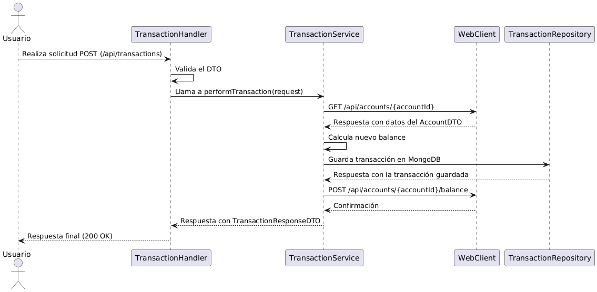
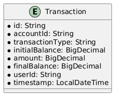

# README: transactional-ms

## Descripción del Proyecto
Este es un microservicio basado en Spring WebFlux llamado `transactional-ms`. Su propósito principal es gestionar transacciones de manera reactiva, interactuando con otros microservicios para validar cuentas y actualizar saldos.

### Tecnologías Utilizadas
- **Spring WebFlux**: Para desarrollar servicios reactivos no bloqueantes.
- **MongoDB Reactivo**: Base de datos no relacional para almacenamiento de transacciones.
- **SpringDoc**: Generación automática de documentación OpenAPI/Swagger.
- **Lombok**: Para reducir el código repetitivo.

---

## Configuración Inicial

### Propiedades del Microservicio

```properties
spring.application.name=transactional-ms

server.port=${PORT}

springdoc.swagger-ui.enabled=true
springdoc.api-docs.enabled=true
springdoc.swagger-ui.path=/swagger-ui.html
springdoc.api-docs.path=/v3/api-docs
springdoc.webjars.prefix=/webjars

server.servlet.context-path=/transactional-ms

spring.data.mongodb.uri=${MONGO_URI}
spring.data.mongodb.database=${MONGO_DATA_BASE}
```

### Dependencias Principales

```gradle
dependencies {
    implementation 'org.springframework.boot:spring-boot-starter-data-mongodb-reactive'
    implementation 'org.springframework.boot:spring-boot-starter-validation'
    implementation 'org.springframework.boot:spring-boot-starter-webflux'
    compileOnly 'org.projectlombok:lombok'
    annotationProcessor 'org.projectlombok:lombok'
    implementation 'org.springdoc:springdoc-openapi-starter-webflux-ui:2.3.0'
}
```

---

# Estructura del Proyecto: transactional-ms

A continuación, se detalla la estructura del proyecto **transactional-ms**. Este proyecto sigue una organización típica de una aplicación Java basada en Gradle, utilizando una arquitectura modular para mantener el código limpio y escalable.

## Estructura de Carpetas

```plaintext
C:.
├───.gradle
│   ├───8.11.1
│   │   ├───checksums
│   │   ├───executionHistory
│   │   ├───expanded
│   │   ├───fileChanges
│   │   ├───fileHashes
│   │   └───vcsMetadata
│   ├───buildOutputCleanup
│   └───vcs-1
├───.idea
│   ├───inspectionProfiles
│   └───modules
├───build
│   ├───classes
│   │   └───java
│   │       ├───main
│   │       │   └───com
│   │       │       └───example
│   │       │           └───transactionalms
│   │       │               ├───config
│   │       │               ├───controller
│   │       │               ├───dto
│   │       │               ├───model
│   │       │               ├───repository
│   │       │               └───service
│   │       └───test
│   │           └───com
│   │               └───example
│   │                   └───transactionalms
│   │                       └───controller
│   ├───generated
│   ├───reports
│   ├───resources
│   ├───test-results
│   └───tmp
├───gradle
│   └───wrapper
└───src
    ├───main
    │   ├───java
    │   │   └───com
    │   │       └───example
    │   │           └───transactionalms
    │   │               ├───config
    │   │               ├───controller
    │   │               ├───dto
    │   │               ├───model
    │   │               ├───repository
    │   │               ├───service
    │   │               └───utils
    │   └───resources
    └───test
        └───java
            └───com
                └───example
                    └───transactionalms
                        └───controller
```

## Flujo de Trabajo del Microservicio

### 1. Recepción de la Solicitud
El endpoint `/api/transactions` recibe un DTO con los detalles de la transacción, como el tipo, monto y cuenta de origen. El método valida los datos ingresados y, si son válidos, llama a un servicio que realiza la transacción.

### 2. Llamada a Otro Microservicio
El servicio usa un cliente WebClient para comunicarse con otro microservicio que expone información de cuentas:

```java
webClient.get()
    .uri("/{id}", request.getAccountId())
    .retrieve()
    .bodyToMono(AccountDTO.class)
```

Esta llamada obtiene el balance actual de la cuenta asociada al `accountId`.

### 3. Lógica de Negocio
Se calcula el balance final basado en el tipo de transacción (DEPOSIT o WITHDRAWAL). Si el balance no es suficiente para un retiro, se lanza una excepción.

### 4. Persistencia y Actualización de Datos
La transacción se guarda en MongoDB y se notifica al microservicio de cuentas para actualizar el saldo:

```java
transactionRepository.save(transaction)
    .flatMap(savedTransaction -> webClient.post()
        .uri("/{id}/balance", request.getAccountId())
        .bodyValue(new UpdateBalanceRequest(finalBalance))
        .retrieve()
        .bodyToMono(Void.class))
```

### 5. Flujo Reactivo de Transacciones
El endpoint `/api/transactions/stream` expone un flujo continuo de transacciones usando un cursor "tailable" de MongoDB.

```java
transactionRepository.findWithTailableCursor()
```

---

### 6. Diagrama de secuencia



## Documento


## Documentación OpenAPI
Swagger se encuentra habilitado y puede accederse desde:
- [Swagger UI](http://localhost:PORT/transactional-ms/swagger-ui.html)
- [Documentación OpenAPI](http://localhost:PORT/transactional-ms/v3/api-docs)

---

## Ejecución y Pruebas
1. Asegúrate de configurar las variables de entorno `PORT`, `MONGO_URI`, y `MONGO_DATA_BASE`.
2. Ejecuta el microservicio con el siguiente comando:
    ```bash
    ./gradlew bootRun
    ```
3. Verifica los endpoints usando Swagger o herramientas como Postman.

---

## Notas Finales
Este microservicio demuestra cómo usar Spring WebFlux para construir servicios altamente escalables y eficientes. Es ideal para casos donde las operaciones deben procesarse en tiempo real, como sistemas financieros o plataformas de comercio electrónico.


# Licencia SIAH

Copyright (c) [2025] [Sergio Ismael Ayala Hernandez]